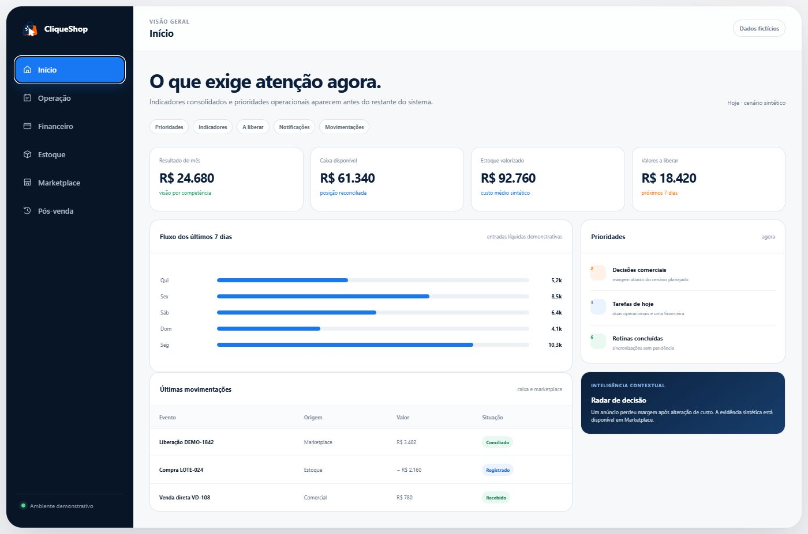
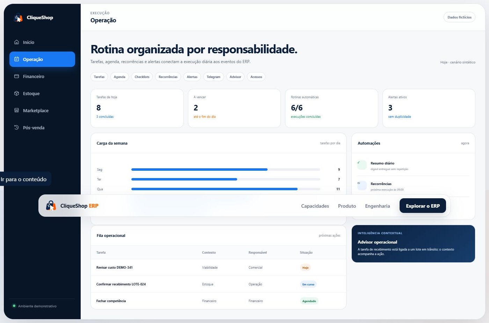
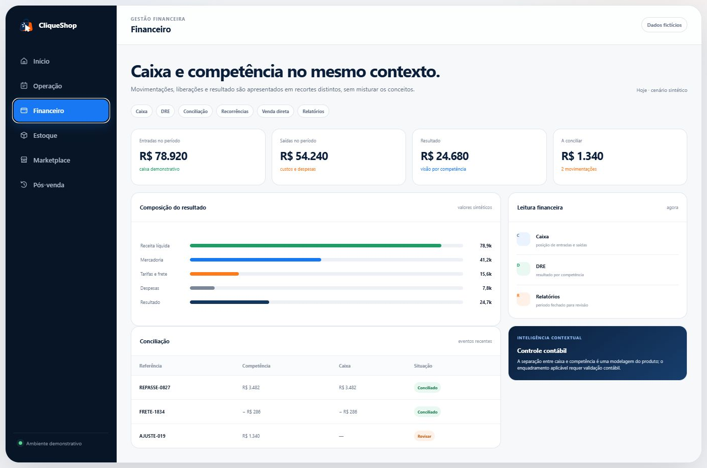
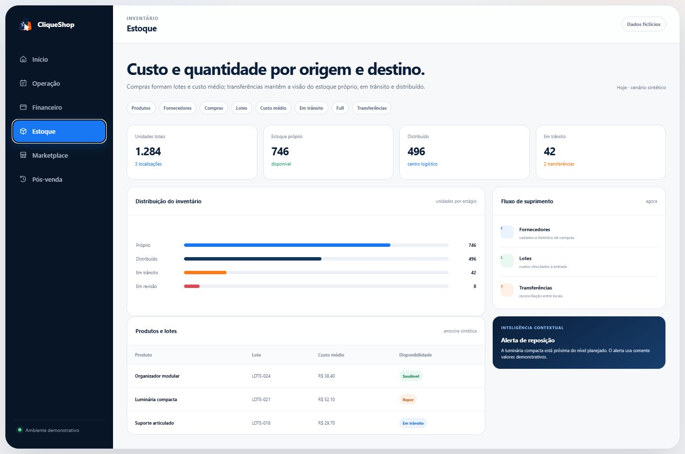
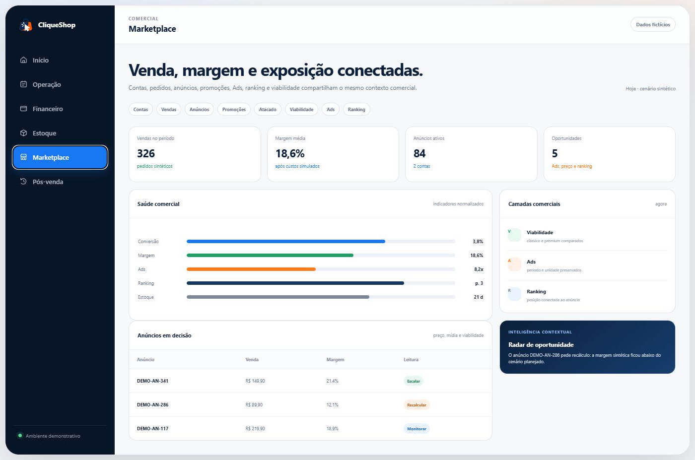
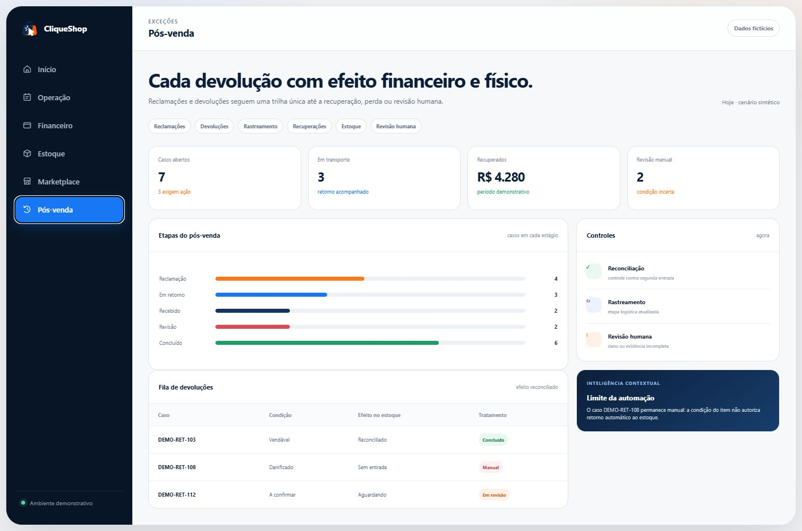
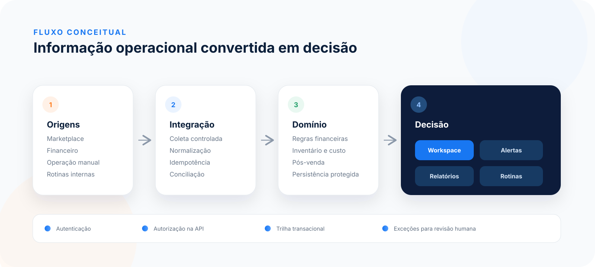

  <a href="README.md">English</a> · <strong>Português</strong>

  

<h1 align="center">CliqueShop ERP</h1>

  Operação financeira, comercial e logística de e-commerce em um único fluxo.

  <a href="#tour-visual">Tour visual</a> ·
  <a href="#mapa-funcional">Mapa funcional</a> ·
  <a href="docs/pt-BR/ARQUITETURA.md">Arquitetura</a> ·
  <a href="docs/pt-BR/MODULOS.md">Módulos</a>

> [!IMPORTANT]
> Este é um repositório de portfólio. A demonstração usa somente dados fictícios e não contém o código-fonte, banco, integrações, credenciais ou dados operacionais do produto de produção.

## O produto

Vendas, liberações financeiras, custos, anúncios, estoque distribuído, devoluções e tarefas operacionais chegam por fontes diferentes. O CliqueShop ERP normaliza esses eventos e apresenta cada informação no contexto da decisão que precisa ser tomada.

O workspace foi organizado para:

- destacar exceções e próximas ações antes dos relatórios;
- distinguir fluxo de caixa e competência em camadas próprias;
- acompanhar custo, quantidade e localização do inventário;
- relacionar venda, anúncio, mídia, ranking e viabilidade;
- tratar o pós-venda até seu efeito financeiro e físico;
- automatizar cenários elegíveis e manter incertezas em revisão humana.

## Tour visual

As telas abaixo foram geradas a partir do mock deste repositório. Nomes, IDs, valores e indicadores são sintéticos.

| Início | Operação |
| --- | --- |
| Visão consolidada, liberações e prioridades. | Tarefas, agenda, recorrências, alertas e acessos. |
|  |  |

| Financeiro | Estoque |
| --- | --- |
| Caixa, competência, conciliação e relatórios. | Produtos, compras, lotes, custo e distribuição. |
|  |  |

| Marketplace | Pós-venda |
| --- | --- |
| Vendas, anúncios, promoções, Ads, ranking e viabilidade. | Reclamações, devoluções, recuperações e revisão humana. |
|  |  |

## Mapa funcional

| Área | Capacidades |
| --- | --- |
| **Início** | prioridades, indicadores, valores a liberar, notificações e movimentações |
| **Operação** | tarefas, agenda, checklists, recorrências, alertas, Telegram, advisor, cadastros e acessos |
| **Financeiro** | caixa, DRE, conciliação, lançamentos recorrentes, venda direta e relatórios |
| **Estoque** | produtos, fornecedores, compras, lotes, custo médio, estoque em trânsito, distribuído e transferências |
| **Marketplace** | contas, vendas, anúncios, promoções, atacado, viabilidade, Ads e ranking |
| **Pós-venda** | reclamações, devoluções, rastreamento, recuperações, efeito no estoque e revisão humana |

O inventário detalhado de responsabilidades e limites públicos está em [Módulos do produto](docs/pt-BR/MODULOS.md).

## Três decisões que organizam o sistema

### Saber o que exige atenção

A operação começa pelas exceções: tarefas próximas, alertas, liberações, estoque em risco e eventos que pedem validação. Indicadores continuam disponíveis, sem ocupar o lugar da próxima ação.

### Decidir antes de comprar ou anunciar

A viabilidade combina entradas essenciais e apresenta cenários comerciais comparáveis. Os coeficientes exibidos neste repositório são demonstrativos e não reproduzem tarifas ou parâmetros de produção.

### Resolver o pós-venda sem duplicar estoque

Nos cenários elegíveis cobertos por regressão, controles de reconciliação evitam uma segunda entrada da mesma devolução. Produto danificado ou evidência incompleta permanece em revisão manual.

## Arquitetura

~~~text
Marketplace + financeiro + operação manual
                    ↓
       Integração e normalização
                    ↓
   Regras financeiras e de inventário
                    ↓
     Base transacional protegida
                    ↓
Workspace autenticado + alertas + rotinas
~~~

O diagrama é intencionalmente abstrato. Endpoints, topologia, contratos, chaves de deduplicação e regras proprietárias não fazem parte da exposição pública. Veja [Arquitetura e limites](docs/pt-BR/ARQUITETURA.md).

## Sob o capô

- **Backend:** Python e Django.
- **Persistência:** PostgreSQL.
- **Interface:** JavaScript e CSS responsivos.
- **Operação:** containers, processos agendados, alertas e integrações por APIs das plataformas.
- **Validação:** cenários de regressão para regras financeiras, custo e estoque, sincronização, pós-venda e permissões.

Contagens de testes, volumes produtivos, economia e resultados financeiros não são publicados sem uma medição reproduzível e autorizada.

## Princípios de produto

- **Próxima ação primeiro.** A interface revela complexidade conforme ela se torna necessária.
- **Pouca entrada manual.** O design busca reduzir preenchimento e reutilizar contexto já conhecido.
- **Uma responsabilidade por ação.** Controles aparecem somente quando produzem um efeito real.
- **Automação com limite.** Casos incertos continuam visíveis para decisão humana.
- **Segurança em profundidade.** Restrições relevantes pertencem também ao servidor e à API.

## Minha atuação

Este estudo de caso apresenta trabalho de produto e engenharia realizado por Leonardo Trancozo:

- descoberta do fluxo operacional e modelagem do domínio;
- arquitetura e implementação do ERP;
- UX do workspace e organização das jornadas;
- automações, integrações e rotinas agendadas;
- estratégia de testes, validação operacional e evolução do produto.

## Executar a demonstração

A vitrine é estática, não usa banco e não realiza chamadas de API. O único estado de navegação é o fragmento local da URL.

~~~bash
python -m http.server 8080
~~~

Depois, abra <code>http://localhost:8080</code>. Também é possível abrir <code>index.html</code> diretamente. A pasta também está pronta para GitHub Pages.

## Conteúdo público deste repositório

~~~text
.
├── .gitignore
├── README.md
├── README.pt-BR.md
├── NOTICE.md
├── NOTICE.pt-BR.md
├── SECURITY.md
├── SECURITY.pt-BR.md
├── index.html
├── styles.css
├── app.js
├── assets/
│   ├── architecture.svg
│   ├── cliqueshop-mark.svg
│   └── screens/
└── docs/
    ├── ARCHITECTURE.md
    ├── MODULES.md
    └── pt-BR/
~~~

O HTML, CSS e JavaScript implementam apenas o mock independente usado nesta apresentação. Nenhum build copia arquivos do ERP privado.

## Segurança, privacidade e propriedade intelectual

- Nenhuma captura do ambiente produtivo.
- Nenhum dado real apenas borrado; as fixtures são fictícias desde a origem.
- Nenhum banco, dump, planilha, documento operacional, arquivo de ambiente ou credencial.
- Nenhum domínio, IP, rota administrativa ou identificador do produto de produção.
- Nenhum contrato de API, parser, regra comercial completa ou código da extensão.

Este material não possui licença open source. Um repositório público pode ser visualizado e forkado conforme as funcionalidades e os termos do GitHub; isso não concede direitos adicionais de modificação, distribuição ou exploração comercial, nem qualquer licença sobre o produto de produção. Consulte [NOTICE.pt-BR.md](NOTICE.pt-BR.md).
